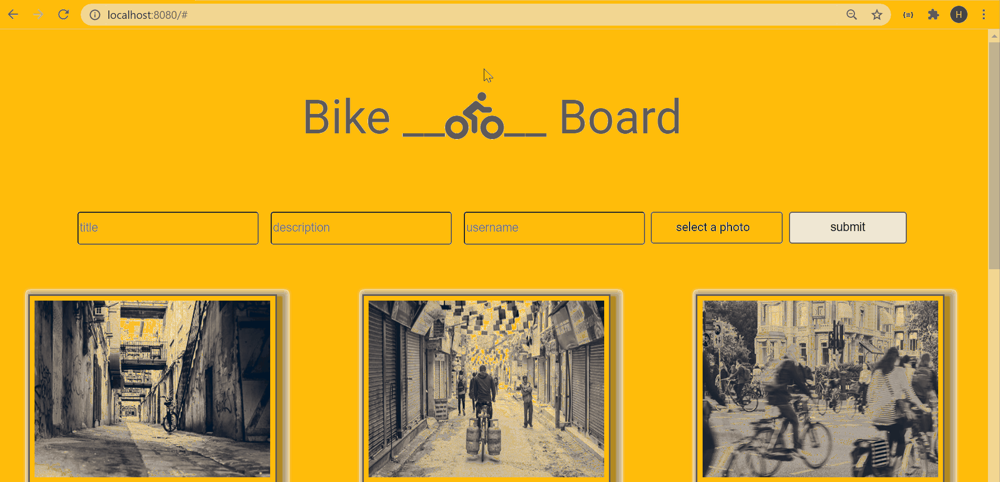

# KiezCommunity Social Network

## Description

Bike-Board is a single-page application website to collect photos of bikes in real world settings. Users can upload photos, delete them and put comments on other photos. 1

## Technology

-   Vue.js
-   Node.js
-   Express.js
-   axios
-   AWS S3
-   PostgreSQL
-   HTML/CSS

## Features

-   Users can see the last six uploaded photos on the website when they open it. Clicking on the "more" button will show another six photos on the page. When there is no more photo to show, the "more" button will disapear.

-   Users can upload their photo with title and discription and AWS stored photo will apear immediately on the page.

-   Each user can click on a photo to open a modal to see the image in a biger size, put comments on it or delete the photo.

-   Because of hash routing, there is a possibility to open a modal directly from browser's address bar or share the link of the photo with others.

